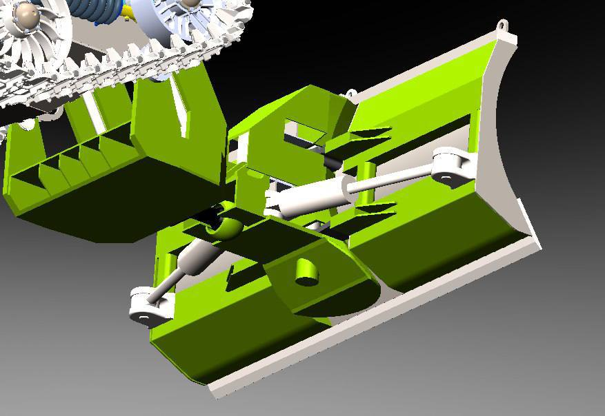
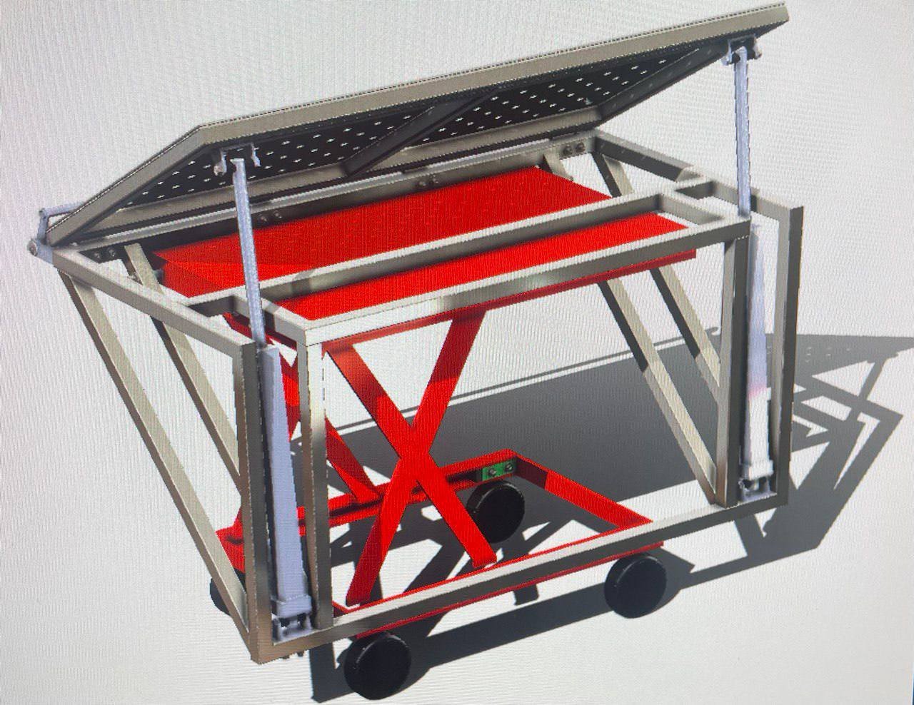

# Резюме

## Личная информация

    ФИО: Тятихин Илья Вадимович

    Дата рождения: 14/05/1997

    Город проживания: Сергиев Посад

Готовность к переезду, командировкам: Да

    Образование: высшее, инженер, конструкторско-механический факультет МАДИ,

    специализация: "Тягачи и амфибийные машины", 6 курсов, 2021

    аспирантура: ДСФ, "Теоретическая механика, динамика машин", 2022-2024

    Стаж работы (по специальности/ общий): 5/8
    Занимаемые должности: Техник-конструктор, инженер-конструктор, инженер группы мат. моделирования и оценки прочности, инженер направления прочности;

    Ассистент преподавателя по дисциплинам "Начертательная геометрия"
    
    Старший преподаватель "Начертательная геометрия", "Инженерная графика", "Компьютерная графика в Компас 3D"

    Доп. образование: "Основы программирования на С++", "Git - система контроля и учёта версий"
________________________________________________________________________________

Желаемая должность: Embedded-разработчик, Инженер-программист

Завершённые проекты:

